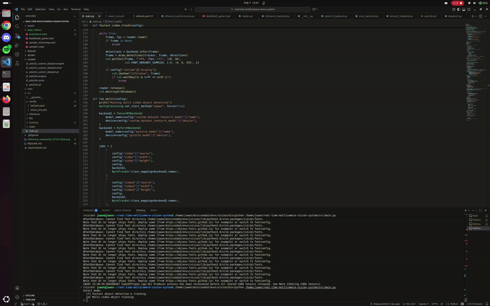

# Real-Time Multi-Camera Video Inference & Tracking Pipeline

**Project Overview**  
A modular, high-performance multi-camera object detection and tracking pipeline with YOLO26, SORT, ByteTrack, and DeepSORT, supporting PyTorch, ONNX, and TensorRT backends.

---

## Features

- **Multi-Camera Support** – Ingest video from webcams, RTSP streams, or video files.  
- **Object Detection & Tracking** – Built-in support for YOLO26 detection and modular trackers like SORT, DeepSORT, or ByteTrack.  
- **Modular Inference Backends** – Supports PyTorch, ONNX Runtime, and TensorRT for optimized GPU/CPU performance.  
- **Custom Dataset Support** – Train models on your own datasets.  
- **Performance Benchmarking** – Automatically selects fastest model and tracker combinations.  
- **Configurable & Modular** – YAML-based configuration for easy swapping of sources, models, and runtime parameters.  
- **Dockerized Deployment** – Fully containerized for reproducibility and portability.

---

## Demo / Videos


### Multi-Camera Tracking Example



## Installation

### Clone Repository

```bash
git clone https://github.com/OlajuwonDele/real-time-multicamera-vision-system.git
cd real-time-multicamera-vision-system
```
### Python Environment
```bash
conda create -n vision python=3.9 -y
conda activate vision
pip install -r requirements.txt
```

### Docker
```bash
docker build -t multi-camera-vision .
docker run --gpus all -it -v /path/to/videos:/videos multi-camera-vision
```

## Usage
Run the main script:
```bash
python src/main.py
```
You will be prompted to select a mode:

[f] Run fastest single-camera detection & tracking

[m] Run multiple video feeds simultaneously

## Configuration
All runtime settings are in src/config/default.yaml:

Video sources, resolutions, and display options

Model paths and backends

Runtime options such as FPS display, batch size, or GPU selection
